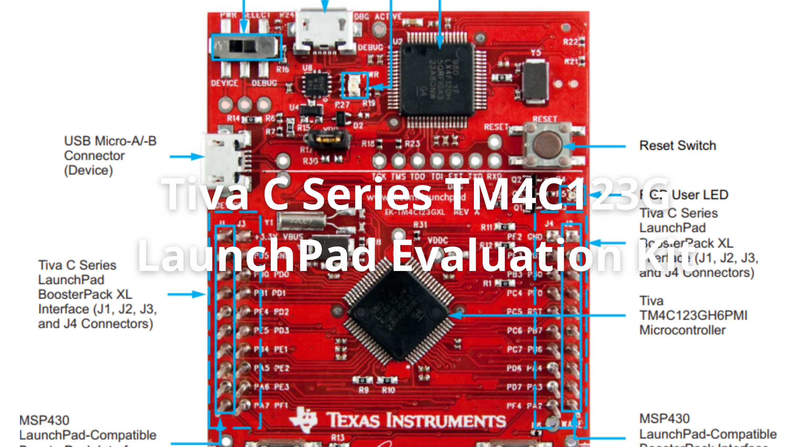
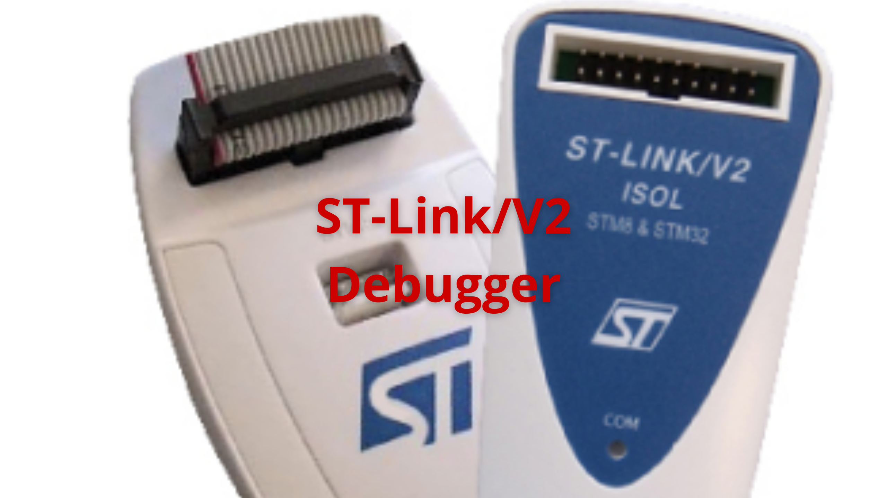
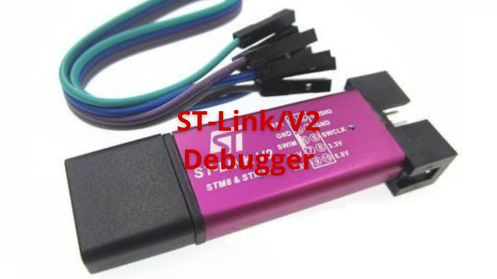
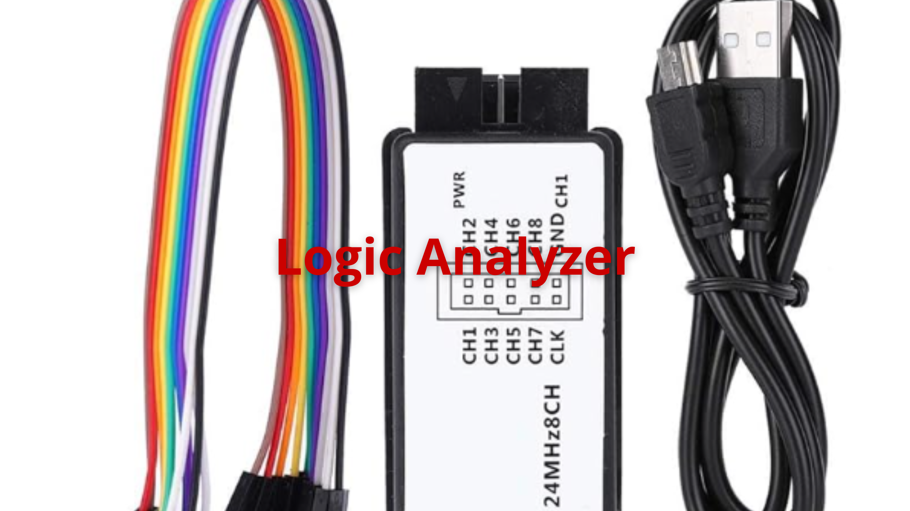
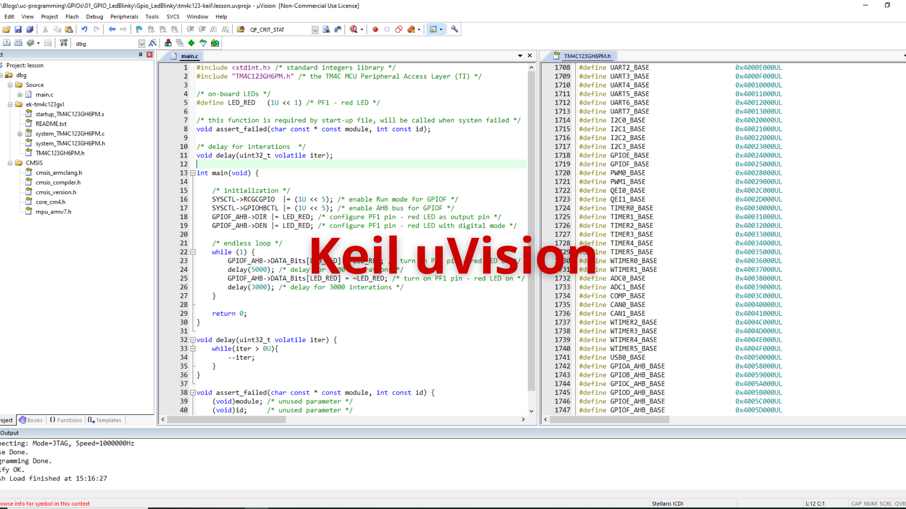
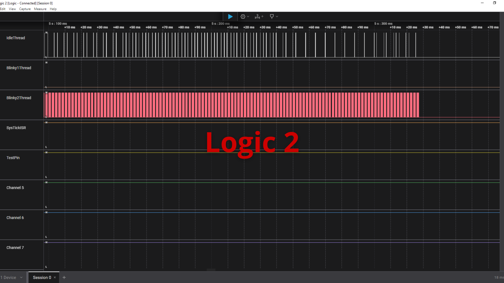

# Demo Projects

🚀 Welcome to Demo Projects! This repository is dedicated to sharing knowledge and practical experience in embedded software programming, covering topics from basic concepts to advanced techniques. Whether you are a beginner looking to understand the fundamentals or an experienced developer seeking deeper insights, you will find articles, tutorials, and project examples designed to help you grow your skills in embedded systems development.

<!-- Images Placeholder -->

<!-- Add more images as needed -->

# List of Demo Projects

1. [Basic embedded C demo using STM32F103C6](/stm32f103c6-demo/README.md)
2. [Overview and best practices for data types in embedded C](/embedded-c-data-types/README.md)
3. [Struct and union data types in embedded C](/struct-union-data-types/README.md)

# Development Toolbox

## Development Boards

🎯 Development boards are essential for prototyping and building embedded systems. This section features popular boards used in the demo projects, highlights their key features, and offers guidance to help you choose the right hardware for your needs.

### STM32F103 Blue Pill Development Board

🚀 [STM32F103 Blue Pill Development Board](https://stm32-base.org/boards/STM32F103C8T6-Blue-Pill.html). 

<!-- Images Placeholder -->

<!-- Add more images as needed -->

🔑 **Key Features:**
- STM32F103C8T6 microcontroller (ARM Cortex-M3, 32-bit, up to 72 MHz)
- 64 KB Flash, 20 KB SRAM
- Multiple GPIOs, timers, ADCs, PWM, and communication interfaces (UART, SPI, I2C, USB)
- Low cost solution for embedded development, making it ideal for students, hobbyists, and anyone starting out with ARM microcontrollers.

✅ **Typical Use Cases:**
- Learning and experimenting with ARM Cortex-M3 architecture
- Developing and debugging real-time embedded applications
- Prototyping projects involving sensor integration, motor control, and USB communication

### Tiva C Series TM4C123G LaunchPad Evaluation Kit

🚀 [Tiva C Series TM4C123G LaunchPad Evaluation Kit - EK-TM4C123GXL](https://www.ti.com/tool/EK-TM4C123GXL)

<!-- Images Placeholder -->

<!-- Add more images as needed -->

🔑 **Key Features:**
- TM4C123G microcontroller (ARM Cortex-M4F, 32-bit, up to 80 MHz)
- 256 KB Flash, 32 KB SRAM
- On-board Stellaris ICDI for programming and debugging
- Multiple GPIOs, timers, ADCs, PWM, and communication interfaces (UART, SPI, I2C, USB)
- User LEDs and push-buttons for easy prototyping
- BoosterPack headers for hardware expansion

✅ **Typical Use Cases:**
- Learning and experimenting with ARM Cortex-M4F architecture
- Developing and debugging real-time embedded applications
- Prototyping projects involving motor control, sensor integration, and USB communication

### STM32F407 Discovery Development Kit

🚀 [STM32F407VG Discovery Development Kit](https://www.st.com/en/evaluation-tools/stm32f4discovery.html)

<!-- Images Placeholder -->

<!-- Add more images as needed -->

🔑 **Key Features:**
- STM32F407VG microcontroller with 1 MB Flash and 192 KB RAM
- On-board ST-LINK/V2 for programming and debugging
- Multiple GPIOs, timers, ADCs, DACs, and communication interfaces (USART, SPI, I2C, CAN, USB)
- Integrated audio DAC, MEMS microphone, and accelerometer for advanced applications
- User LEDs and push-buttons for easy prototyping
- USB OTG and microSD card support

✅ **Typical Use Cases:**
- Learning and experimenting with ARM Cortex-M4 architecture
- Developing and debugging real-time embedded applications
- Prototyping projects involving audio processing, sensor integration, and USB communication

### ST-Link Mini Debugger

🚀 [WeAct Studio's ST-Link Mini Debugger](https://github.com/WeActStudio/WeActStudio.MiniDebugger)

<!-- Images Placeholder -->

<!-- Add more images as needed -->

🔑 **Key Features:**
- Compact and affordable ST-Link V2 compatible debugger
- Supports programming and debugging STM32 and STM8 microcontrollers
- USB interface for easy connection to PC
- Compatible with popular IDEs such as STM32CubeIDE, Keil, and PlatformIO
- LED indicators for power and data status

✅ **Typical Use Cases:**
- Flashing firmware to STM32/STM8 microcontrollers
- Debugging embedded applications during development
- Ideal for hobbyists, students, and professionals needing a portable and reliable debugging tool

### ST-Link/V2 Debugger
🚀 [ST-Link/V2](https://www.st.com/en/development-tools/st-link-v2.html)

<!-- Images Placeholder -->

<!-- Add more images as needed -->

🔑 **Key Features:**
- Official STMicroelectronics debugger and programmer for STM8 and STM32 MCUs
- Supports SWD (Serial Wire Debug) and JTAG interfaces
- USB interface for easy connection to PC
- Compatible with STM32CubeIDE, Keil, IAR, and other popular IDEs
- Robust build quality and reliable performance

✅ **Typical Use Cases:**
- Programming and debugging STM32 and STM8 microcontrollers
- Developing and troubleshooting embedded applications
- Suitable for professional and educational use

💡 Another alternative is a lightweight and low-cost version of the ST-Link/V2 debugger for STM8 and STM32 microcontrollers, suitable for budget-conscious users and simple development needs.

<!-- Images Placeholder -->

<!-- Add more images as needed -->

### Logic Analyzer
🚀 Additionally, during testing and debugging, I use a logic analyzer to measure and capture the signals of microcontroller input/output pins. Logic analyzers are low cost and easy to use, making them ideal for quickly visualizing digital signals, troubleshooting communication protocols, and verifying timing in embedded projects.

<!-- Images Placeholder -->

<!-- Add more images as needed -->

## Development Tools

🎯 Development tools are vital for creating, testing, and debugging embedded software. In this section, I discuss commonly used tools such as IDEs, compilers, and debuggers, along with those featured in the demo projects. These resources will help you set up an efficient workflow and tackle real-world embedded development challenges.

### Keil uVision IDE
🚀 [Keil uVision IDE](https://www.keil.com/demo/eval/arm.htm). 

<!-- Images Placeholder -->

<!-- Add more images as needed -->

🔑 **Key Features:**
- Integrated development environment for ARM Cortex-M microcontrollers
- Powerful editor, compiler, and debugger in one tool
- Supports project management, code completion, and error checking
- Built-in flash programming and real-time debugging
- Extensive device support for STM32, NXP, TI, and more
- Free non-commercial version available for students and hobbyists

✅ **Typical Use Cases:**
- Writing, compiling, and debugging embedded C code
- Flashing firmware to ARM microcontrollers
- Learning and prototyping embedded applications

### Logic 2
🚀 [Logic 2](https://www.saleae.com/pages/downloads)

<!-- Images Placeholder -->

<!-- Add more images as needed -->

🔑 **Key Features:**
- Intuitive interface for visualizing and analyzing digital signals
- Supports a wide range of logic analyzers, including Saleae devices
- Protocol decoding for I2C, SPI, UART, CAN, and more
- Easy export and sharing of captured data
- Cross-platform support (Windows, macOS, Linux)

✅ **Typical Use Cases:**
- Debugging and analyzing microcontroller communication protocols
- Visualizing timing and signal integrity
- Troubleshooting embedded hardware and firmware issues

# Demo Projects
🚀 [Demo Projects](/)

# Repositories
🏠 [My Repositories](https://github.com/jet-studio)

# My Website
🌐 [Jet Studio](https://jet-studio.github.io/)

# Contact & Discussion
If you have any thing would like to discuss or cooperate with me, please don't hesitate to contact me via:
- 📧 Email [Ho Thien Ai](mailto:thienaiho95@gmail.com)
- 💼 LinkedIn [Thien Ai Ho](https://www.linkedin.com/in/thien-ai-ho/)
