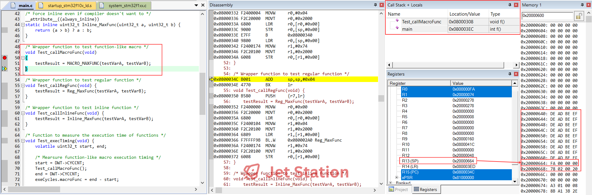

# Embedded C Inline Functions

🎯 Inline functions are a powerful feature in embedded C programming that can significantly improve performance while maintaining code readability and type safety. In this comprehensive guide, I'll explore their usage, benefits, and limitations in embedded systems development.

## **What are Inline Functions?**
💡 Inline functions are a C99/C++ feature where the compiler replaces function calls with the actual function code, eliminating call overhead.

```c
static inline uint32_t max(uint32_t a, uint32_t b) {
    return (a > b) ? a : b;
}
```

## Embedded C Inline Functions Demo Project
🔑 In this demonstration, I will cover the following points:
- [x] How functions are compiled?
- [x] How stack and call stack grow for each function call?
- [x] How long the execution times of functions?

🔽 You can find the final source here: [Embedded C Inline Functions Demo Project](Demo_Project/)
- 🔨 Development Boards: [STM32F103 Blue Pill Development Board](/README.md)
- 🔧 Tools: [Keil uVision](/README.md)

### Find the Maximum Number
To find the maximum value of 2 variables, I have 3 different types of functions:

#### Function-like Macro - `MACRO_MAXFUNC()`

```C
/* Function-like macro */						   
#define MACRO_MAXFUNC(a, b) ((a) > (b) ? (a) : (b))
```

👉 I have an article about C Macro you can refer to here for more details: [Macros in embedded C: Usage, best practices, and pitfalls](/c-macro/README.md)

#### Regular Function - `Reg_MaxFunc()`

```C
/* Regular function */
uint32_t Reg_MaxFunc(uint32_t a, uint32_t b) {
    return (a > b) ? a : b;
}
```

#### Inline Function - `Inline_MaxFunc()`

💡 In order to force the compiler to consider the function as inline type, we need to use `__attribute__((always_inline))` and `static inline` keywords.

```C
/* Force inline even if compiler doesn't want to */
__attribute__((always_inline)) 
static inline uint32_t Inline_MaxFunc(uint32_t a, uint32_t b) {
    return (a > b) ? a : b;
}
```

#### Insights
💡 Even though these 3 functions are implemented, `Inline_MaxFunc()` and `MACRO_MAXFUNC()` functions will not be listed in the map file because they are replaced by the actual code in the program. Only the `Reg_MaxFunc()` function exists.


### Testing Functions

To easily understand how maximum functions are compiled and executed, I created some testing functions to call their corresponding maximum functions:
- `Test_callMacroFunc()`
- `Test_callRegFunc()`
- `Test_callInlineFunc()`

#### `Test_callMacroFunc()` Function

👉 The `MACRO_MAXFUNC` macro inside the function is replaced by the actual code in the assembly view:


👉 To know the code size of the function, you can look at the map file:


#### `Test_callRegFunc()` Function

👉 The `Test_callRegFunc()` is called inside of the function by using its label in the code `Test_callRegFunc`:


👉 To know the code size of the function, you can look at the map file:


#### `Test_callInlineFunc()` Function

👉 The `Test_callInlineFunc()` inline function called inside the function, is replaced by the its actual code in the assemly view:


👉 To know the code size of the function, you can look at the map file:


#### Insights

💡 In summary, you can see that function calls using `inline functions` have a larger code size than function calls using `regular functions`.

💡 This is because the compiler replaces the `inline function` call with the actual code. On the other hand, the `regular function` call is quite simple and has a smaller code size compared to `macro-like function` and `inline function` calls because it does not replace the function with the actual code; instead, it just branches to the code of the called function.


### The Execution of Functions

🚀 Now coming to the interesting section of the article. In this section, I would like you to focus on the growth of the stack and function call stack over the steps of function calls and execution.

💡 To easily determine how much stack resource is consumed for function execution, I manually update the 40 bytes above the stack pointer with the `0xDEADBEEFU` pattern. When the stack grows, it will overwrite this pattern with its actual value.

#### `Test_callMacroFunc()` Function
👉 Start of the function execution:


👉 End of the function execution:



💡 You can see that, of course, there is no additional function added to the `Call Stack`.

💡 From the start to the end of the function, by looking at the overwriting of the `0xDEADBEEFU` pattern in the stack, the stack grows from `0x20000668` to `0x20000664`, consuming 4 more bytes to execute the function.

#### `Test_callRegFunc()` Function
👉 Start of the function execution:


👉 In between of the function execution:


👉 End of the function execution:


💡 You can see that the `Reg_MaxFunc()` function is added to the `Call Stack`. This means `Test_callRegFunc()` has to save the current information of the function execution before branching to the `Reg_MaxFunc()` function.

💡 From the start to the end of the function, by looking at the overwriting of the pattern in the stack, the stack grows from `0x20000668` to `0x20000650`, consuming 20 more bytes to execute the function.

#### `Test_callInlineFunc()` Function
👉 Start of the function execution:


👉 In between of the function execution:


👉 End of the function execution:


💡 You can see that even though the `Inline_MaxFunc()` function is replaced by its actual code, you can still see it in the debug view as a regular function.

💡 There is one observation: the `Call Stack` does not grow. However, it changes from the call of `Test_callInlineFunc()` to the call of `Inline_MaxFunc()` function before changing back to the call of `Test_callInlineFunc()` after the actual code of `Inline_MaxFunc()` is executed.

💡 From the start to the end of the function, by looking at the overwriting of the pattern in the stack, the stack grows from `0x20000668` to `0x2000065C`, consuming 12 more bytes to execute the function.

#### Insights

💡 You can see from the execution of functions that the `regular` function has some trade-offs in **call stack overhead** and **stack consumption** compared to `macro-like` function and `inline` function.

### The Execution Time of Functions

🕒 I can measure the execution cycles of each function with the support of the DWT module and the `Test_execTiming()` function. 


👉 It is very straightforward to see that the execution time of the `Test_callMacroFunc` and `Test_callInlineFunc` functions are faster than the `Test_callRegFunc` function.

💡 This is because they do not create any context switching and function calls inside the function body like the `Test_callRegFunc` function.


## Summary

😐 Personally, I would not say that the `inline` function is the best choice for all cases to speed up function execution time. However, I would say that for more robustness, its usage should depend on your system, design, use case, and also your knowledge and experience.

👇 The information below, which I have collected from different sources, is for your reference when considering using inline functions. I recommend that you verify the correctness of these practices for sure.

## **Benefits in Embedded Programming:**

### **Performance Benefits:**
✅ **No Function Call Overhead** - Eliminates stack operations, parameter passing  
✅ **Faster Execution** - Direct code insertion, no jump instructions  
✅ **Better Optimization** - Compiler can optimize across function boundaries  
✅ **Reduced Stack Usage** - No stack frame creation for small functions  

### **Code Quality:**
✅ **Type Safety** - Unlike macros, provides proper type checking  
✅ **Scope Respect** - Follows normal C scoping rules  
✅ **Debugger Friendly** - Can step through inline code (unlike macros)  
✅ **Side Effect Safe** - Parameters evaluated only once  

### **Memory Benefits:**
✅ **No Function Pointer Overhead** - Direct code insertion  
✅ **Better Cache Performance** - Code stays in instruction cache  

## **Weak Points & Disadvantages:**

### **Code Size Issues:**
❌ **Code Bloat** - Function copied at every call site  
❌ **Increased Flash Usage** - Critical in resource-constrained MCUs  
❌ **Cache Pollution** - More instructions can hurt instruction cache  

### **Compilation Issues:**
❌ **Compiler Dependent** - Inline is just a "hint", not guaranteed  
❌ **Header Dependencies** - Implementation must be in header files  
❌ **Longer Compile Times** - More code to process   

## **When to Use Inline Functions in Embedded:**

### **Good Candidates:**
✅ **Small, frequently called functions** (1-5 lines)  
✅ **Mathematical operations** (min, max, abs)  
✅ **Bit manipulation helpers**  
✅ **Register access functions**  
✅ **Time-critical operations**  

### **Avoid Inlining:**
❌ **Large functions** (>10-15 lines)  
❌ **Functions called rarely**  
❌ **Functions with loops**  
❌ **Functions with complex logic**  
❌ **Recursive functions**  

## **Embedded-Specific Considerations:**

### **Memory Constraints:**
- **Flash Limited MCUs** - Be careful with code bloat
- **RAM Tight Systems** - Inline can reduce stack usage
- **Cache-Aware Design** - Consider instruction cache size

### **Real-Time Systems:**
- **Deterministic Timing** - Inline helps eliminate call overhead
- **ISR Performance** - Inline critical ISR helper functions

## **Best Practices:**

### **Size Guidelines:**
```C
// Good - Small, frequently used
static inline void GPIO_Set(uint32_t pin) {
    GPIOA->BSRR = (1U << pin);
}

// Bad - Too large for inline
static inline void ComplexAlgorithm(void) {
    // 20+ lines of code...
}
```

### **Compiler Hints:**
```C
// Force inline (GCC)
__attribute__((always_inline)) inline void critical_function(void);

// Prevent inline (GCC)
__attribute__((noinline)) void debug_function(void);
```

## **Measurement & Optimization:**

### **How to Evaluate:**
1. **Profile Code Size** - Check .map files for size impact
2. **Measure Performance** - Use timing measurements
3. **Monitor Stack Usage** - Verify stack consumption
4. **Test Real Hardware** - Embedded simulators may not be accurate

### **Trade-off Analysis:**
- **Speed vs Size** - Faster execution vs larger flash usage
- **Development vs Production** - Inline for debug, optimize for production
- **Critical vs Non-critical** - Inline only performance-critical paths

## **Conclusion:**
🔓 Inline functions are powerful for embedded programming when used judiciously. They're excellent for small, performance-critical functions but can be detrimental if overused. Always measure the actual impact on your target hardware!

## Folder structure
```
c-inline-function/                         # Main project directory
├── README.md                              # This documentation file
├── Demo_Project/                          # Complete STM32F103 demo project
│   ├── source/                            # Source code directory
│   │   ├── cfg/                           # Configuration files
│   │   ├── drv/                           # Hardware driver files
│   │   └── src/                           # Main application source code
│   └── uVision/                           # Keil uVision project files
└── imgs/                                  # Documentation images
```
# Explore More Topics
|[👈 Previous](/c-macro/README.md) | [Next 👉](/)|

# Embedded C Practical Projects
🚀 [Embedded C Practical Projects](/)

# Repositories
🏠 [My Repositories](https://github.com/jet-studio)

# My Website
🌐 [Jet Station](https://jet-station.github.io/)

# Contact & Discussion
If you have any thing would like to discuss or cooperate with me, please don't hesitate to contact me via:
- 📧 Email [Ho Thien Ai](mailto:thienaiho95@gmail.com)
- 💼 LinkedIn [Thien Ai Ho](https://www.linkedin.com/in/thien-ai-ho/)

