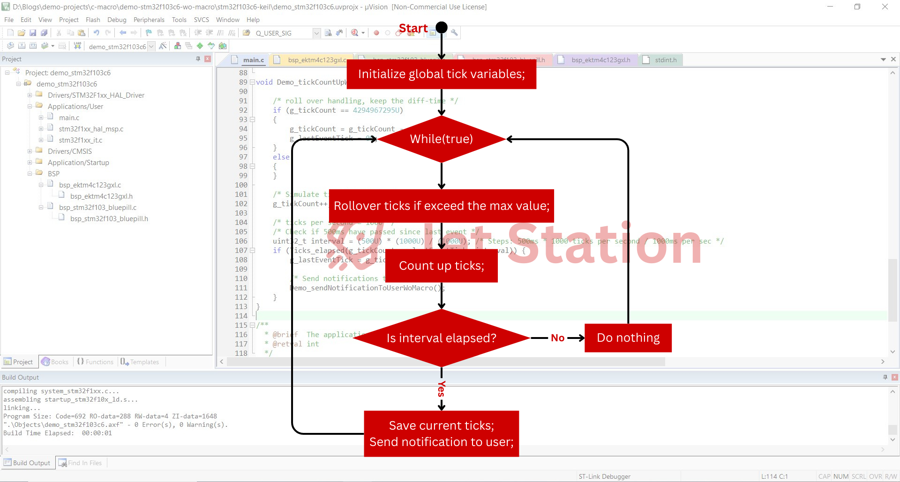
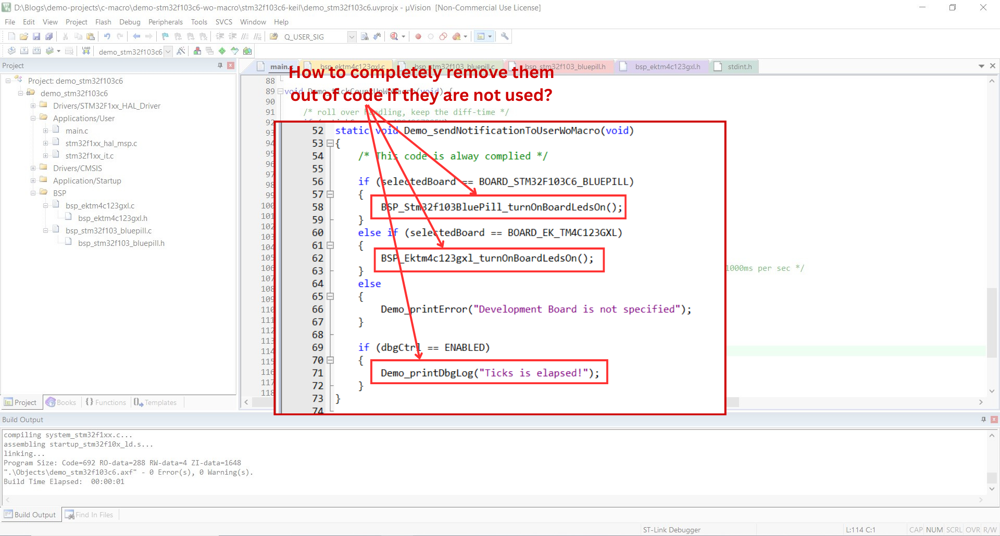
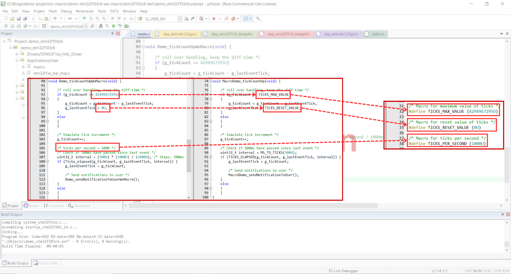
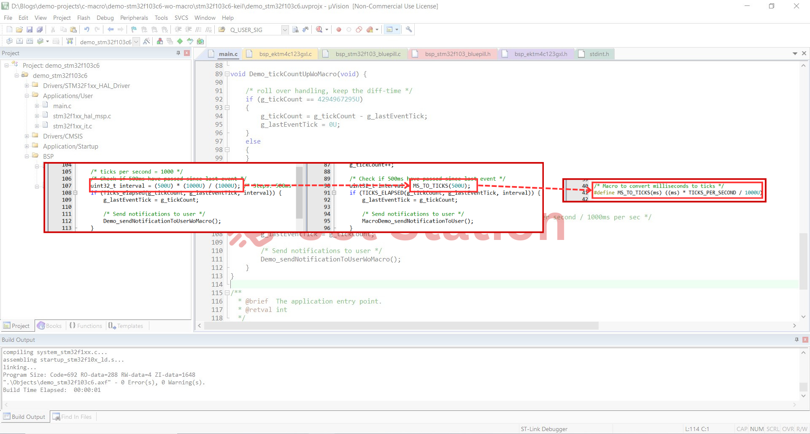
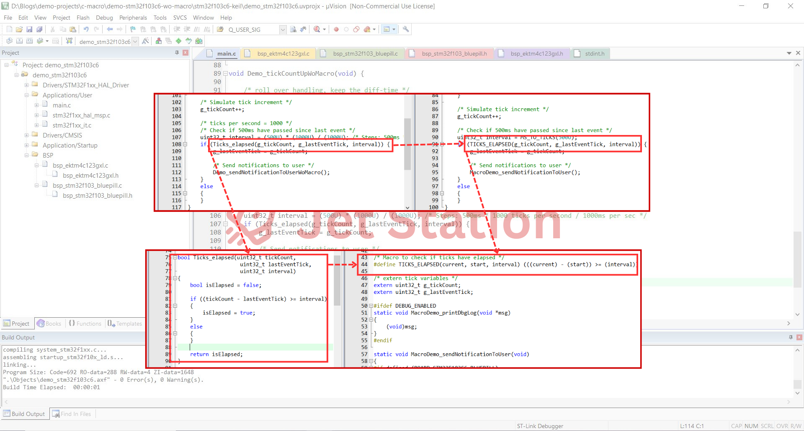
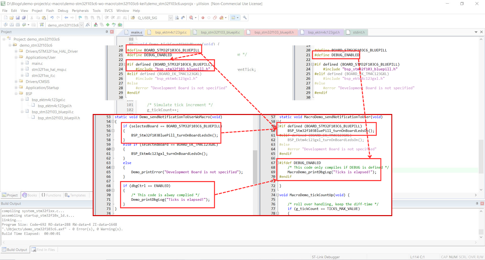
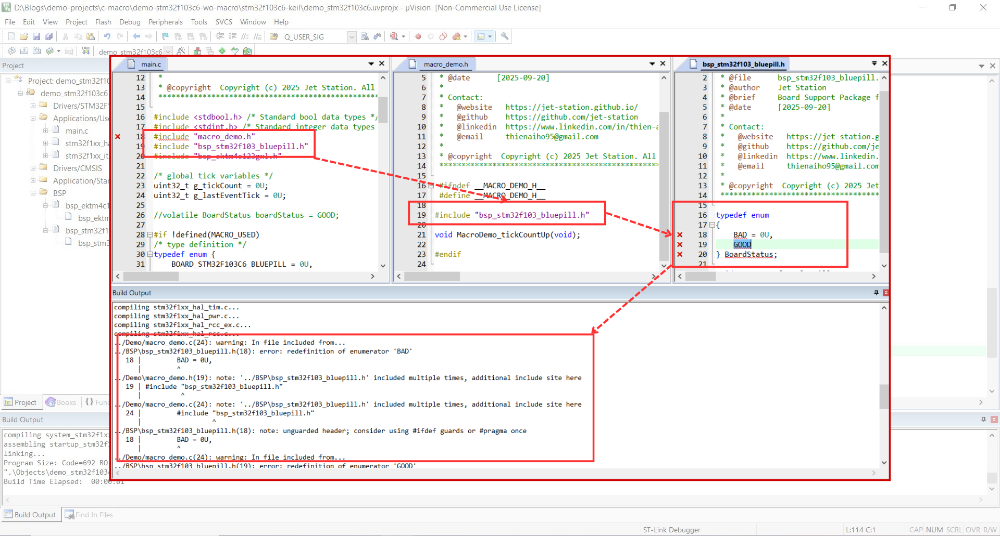
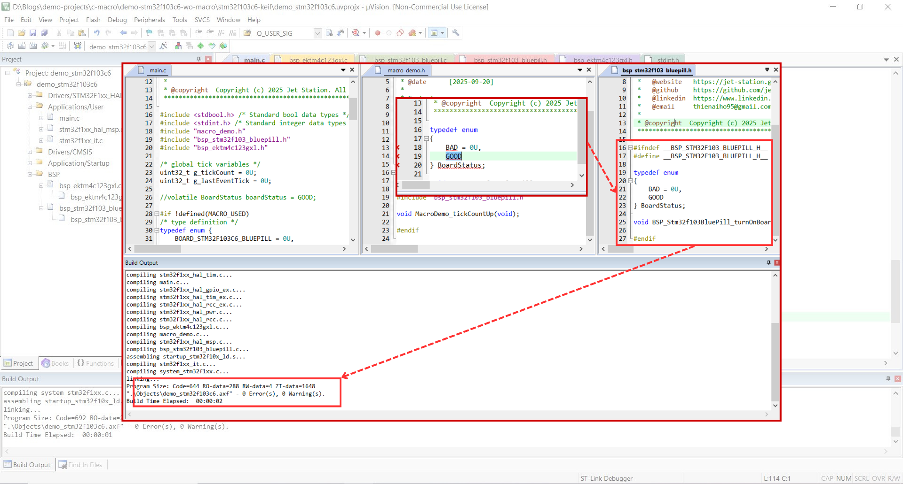

# Embedded C Macro Demo Project

🎯 As you may already know, macros in C are commonly used to replace constant numbers during preprocessing. In this article, I will recap the basic usage of macros and dive deeper into their applications in embedded development to answer the questions below:

- [X] How do you define a constant using macro?
- [x] How do you create a function-like macro?
- [X] How do you use macro for conditional compilation?
- [X] How do you prevent multiple inclusion with macros?
- [X] How do you make your code portable using macros?
- [x] What are the best practices for using macros?


## Basics about Macros
❓ What is a macro in C? 
- 👉 A macro is a preprocessor directive that replaces text before compilation. It's defined using `#define` and performs simple text substitution.

❓ Which compilation step are macros used in?
- 👉 Macros are processed during the preprocessing step, which happens before actual compilation.

# Demo Project

## Software Design

💡 In this demonstration, I simulate a system tick that counts up 1000 times per second. When 500ms have elapsed, the software sends a notification to the user by turning on the on-board LEDs on the development board.

💡 I would like to make the high-level software module compatible with 2 types of boards: the STM32F103 Blue Pill Board and the Tiva C Launchpad EK-TM4C123GXL with the help of Board Support Package (BSP).



There are some goals I would like to achieve:
- ✔️ My software should be readable and easy to understand
- ✔️ I should be able to select the target development board, enable/disable debug code in the software by changing the configurations
- ✔️ Resource consumption should be optimized

# Implementation Approach Without Macro

🔽 Source: [Demonstration Without Macro](demo-stm32f103c6-wo-macro/)

In the first implementation approach, I use constants, variables and functions to implement the software without using any macros. I have the software running as I expect but it has failed to achieve the goals.

## Problems

Some problems you can figure out when first looking at the implementation:
- ❓ What is the meaning of the numbers?
- ❓ What is the purpose of the calculation if I don't write any comments?
- ❓ The function is quite simple and will acquire some resources and trigger a context switch, can I replace it with simpler code and optimize the resources?


- ❓ Board-specific code and debug code still exist in the program at runtime, can I completely remove them when another board is selected and debug mode is disabled to make the program cleaner and use fewer resources?



- ❓ Are there other things that I can optimize?

# Practice With Macro To Enhance The Robustness Of The Software

🔽 You can find the final source here: [Demonstration With Macro](demo-stm32f103c6-w-macro/)
- 🔨 Development Boards: [STM32F103 Blue Pill Development Board](/README.md)
- 🔧 Tools: [Keil uVision](/README.md)

## 1. Constant Definition
👉 Here I see an opportunity to use macros to replace meaningless constants such as `4294967295U`, `0U`, `1000U`.

```C
/* Macro for maximum value of ticks */
#define TICKS_MAX_VALUE (4294967295U)

/* Macro for reset value of ticks */
#define TICKS_RESET_VALUE (0U)

/* Macro for ticks per second */
#define TICKS_PER_SECOND (1000U)
```



**Benefits of using macros:**
- **Avoid repetition** - Define values once, use everywhere
- **Easy maintenance** - Change one place, updates everywhere
- **Better readability** - Use meaningful names instead of magic numbers

## 2. Simple Expression

❔ If the code doesn't have any comments, you may not know what the exact purpose of this line of code is:

```C
uint32_t interval = (500U) * (1000U) / (1000U);
```

👉 I replace it with meaningful code using macros, which makes it easy to understand:

```C
/* Macro to convert milliseconds to ticks */
#define MS_TO_TICKS(ms) ((ms) * TICKS_PER_SECOND / 1000U)

uint32_t interval = MS_TO_TICKS(500U);
```



**Benefits of using macros for expressions:**
- **Code clarity** - Replace complex calculations with descriptive names
- **Compile-time computation** - Values calculated during preprocessing, not runtime

## 3. Function-like Macro

👉 The function `Ticks_elapsed()` is quite simple, so I replace it with a function-like macro. There is no function call overhead because the code from the macro is inserted directly for faster execution.



**Benefits of using function-like macros:**
- **No function call overhead** - Code is directly substituted, faster execution
- **Type flexibility** - Works with any data type (int, float, char, etc.)
- **Performance** - No function call overhead, direct value substitution
- **Compile-time optimization** - Compiler can better optimize inline code
- **Simple operations** - Perfect for basic calculations like MAX, MIN, SQUARE

## 4. Conditional Compilation & Portability

👉 I can use macros for conditional compilation with `#ifdef` or `#if defined` to include/exclude features from the program. The unused code is completely removed from the program.

```C
#if defined (BOARD_STM32F103C6_BLUEPILL)
	#include "bsp_stm32f103_bluepill.h"
#elif defined (BOARD_EK_TM4C123GXL)
	#include "bsp_ektm4c123gxl.h"
#else
	#error "Development Board is not specified"
#endif
```

- I use the `BOARD_STM32F103C6_BLUEPILL` macro to include files and BSP functions for the Blue Pill board and exclude files and BSP functions for the `EK-TM4C123GXL` board.
```C
#define BOARD_STM32F103C6_BLUEPILL
```

- I use the `DEBUG_ENABLED` macro to enable/disable debug code whenever needed.
```C
#define DEBUG_ENABLED
```


**Benefits of using macros for conditional compilation:**
- **Code selection** - Include/exclude features based on build configuration
- **Debug control** - Add debug code only when needed, remove in release builds
- **Platform adaptation** - Switch between different hardware configurations easily
- **Smaller binaries** - Unused code completely removed from final program

## 5. Header Guards

❌ Multiple inclusion happens when the file is included more than one time. The variable, constant, data type is redefined causing this error.



👉 To prevent the multiple inclusion error and help the compilation faster, we can also use the header guard technique. 

✔️ Example: Before including, the complier will check if `bsp_stm32f103_bluepill.h` file is already included or not by `__BSP_STM32F103_BLUEPILL_H__` macro. If yes, the complier will skip processing this file content.

```C
#ifndef __BSP_STM32F103_BLUEPILL_H__
#define __BSP_STM32F103_BLUEPILL_H__

typedef enum
{
	BAD = 0U,
	GOOD
} BoardStatus;

void BSP_Stm32f103BluePill_turnOnBoardLedsOn(void);

#endif
```



**Benefits of using macros for header guards:**
- **Prevent multiple inclusion** - Header files included only once per compilation unit
- **Avoid redefinition errors** - Prevents duplicate function/variable declarations
- **Faster compilation** - Compiler skips already included headers
- **Standard practice** - Universally recognized pattern in C programming

## 6. Stringizing and Token Pasting

👉 You can use the macro to manipulate the string as below:

```C
#define TO_STRING(x) #x
#define CONCAT(a, b) a##b
```

**Benefits of stringizing and token pasting macros:**
- **Convert to strings** - Turn macro arguments into string literals for printing
- **Generate identifiers** - Create new variable/function names dynamically
- **Debug assistance** - Print variable names and values automatically
- **Code generation** - Build repetitive code patterns efficiently

## Best Practices for Using Macros

✔️ Here is a summary of some best practices you should follow when using macros.
### 1. Always Use Parentheses to Avoid Unexpected Behaviour

```c
/* Bad */
#define SQUARE(x) x * x

/* Good */
#define SQUARE(x) ((x) * (x))
```

### 2. Use UPPERCASE for Macro Names

```c
#define MAX_BUFFER_SIZE 1024U
#define LED_PORT GPIOC
```

### 3. Add 'U' Suffix for Unsigned Constants

```c
#define TIMEOUT_MS 5000U
#define MAX_COUNT 100U
```

### 4. Use Include Guards to Avoid Mutiply Inclusion

```c
#ifndef MY_HEADER_H
#define MY_HEADER_H
/* content here */
#endif
```

### 5. Avoid Side Effects in Function-like Macros

```c
/* Bad - evaluates 'x' multiple times */
#define MAX(x, y) ((x) > (y) ? (x) : (y))

/* Better - use inline functions for complex logic */
static inline int max(int x, int y) {
    return (x > y) ? x : y;
}
```

### 6. Use Meaningful Names

```c
/* Bad */
#define N 10

/* Good */
#define MAX_USERS 10
```

### 7. Document Complex Macros

```c
/**
 * @brief Convert milliseconds to system ticks
 * @param ms Milliseconds to convert
 * @return Number of system ticks
 */
#define MS_TO_TICKS(ms) ((ms) * TICKS_PER_SECOND / 1000U)
```

## Disadvantages of Using Macros

- ❌ **No type checking** - Macros accept any data type, can cause errors
- ❌ **Hard to debug** - Debugger shows expanded code, not the original macro
- ❌ **Not suitable for complex logic** - Complex macros become difficult to read and maintain

> [!TIP]
Use inline functions for complex logic instead of macros.

## Folder structure
```
c-macro/
├── README.md
└── demo-stm32f103c6/
	├── BSP/
	├── Core/
	│   ├── Inc/
	│   │   ├── main.h
	│   │   ├── stm32f1xx_hal_conf.h
	│   │   └── stm32f1xx_it.h
	│   ├── Src/
	│   │   ├── main.c
	│   │   ├── stm32f1xx_hal_msp.c
	│   │   ├── stm32f1xx_it.c
	│   │   ├── syscalls.c
	│   │   ├── sysmem.c
	│   │   └── system_stm32f1xx.c
	│   └── Startup/
	├── Demo/
	│   ├── macro_demo.c
	│   └── macro_demo.h
	├── Drivers/
	│   ├── CMSIS/
	│   │   ├── Device/
	│   │   ├── Include/
	│   │   └── LICENSE.txt
	│   └── STM32F1xx_HAL_Driver/
	│       ├── Inc/
	│       ├── LICENSE.txt
	│       └── Src/
	├── demo_stm32f103c6.ioc
	└── stm32f103c6-keil/
		├── DebugConfig/
		├── demo_stm32f103c6.uvguix.ADMIN
		├── demo_stm32f103c6.uvoptx
		├── demo_stm32f103c6.uvprojx
		├── EventRecorderStub.scvd
		├── Listings/
		├── Objects/
		└── startup_stm32f10x_ld.s
```
# Explore More Topics
|[👈 Previous](/embedded-c-function/README.md) | [Next 👉](/)|

# Embedded C Practical Projects
🚀 [Embedded C Practical Projects](/)

# Repositories
🏠 [My Repositories](https://github.com/jet-studio)

# My Website
🌐 [Jet Station](https://jet-station.github.io/)

# Contact & Discussion
If you have any thing would like to discuss or cooperate with me, please don't hesitate to contact me via:
- 📧 Email [Ho Thien Ai](mailto:thienaiho95@gmail.com)
- 💼 LinkedIn [Thien Ai Ho](https://www.linkedin.com/in/thien-ai-ho/)

