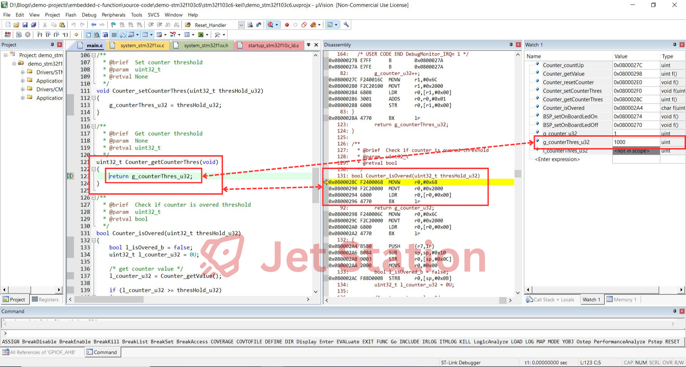

# Embedded C Function

<!-- Images Placeholder -->

<!-- Add more images as needed -->

## Did You already Know?
- [x] Where is the function code stored in the microcontroller memory?
- [x] What is the function call stack?
- [x] Why you need to know the stack and call stack?
- [x] What are the best practices when designing a function?

In this article, I will address these crucial concerns for you.

## How Functions are Used in Embedded C
👉 Functions are fundamental building blocks in embedded C programming. They allow you to organize code into reusable modules, making programs easier to read, maintain, and debug. 

👉 In embedded systems, functions are used to implement hardware control, handle interrupts, process data, and manage system resources efficiently. 

👉 Understanding how to define, use and debug a functions is essential for writing reliable and efficient embedded software.

Example of function declaration, defintion and function call:

- Declaration:

```C
/**
  * @brief  Reset counter value
  * @param  None
  * @retval None
  */
void Counter_resetCounter(void);
```

- Definition:

```C
/**
  * @brief  Reset counter value
  * @param  None
  * @retval None
  */
void Counter_resetCounter(void) 
{
	g_counter_u32 = 0U;
}
```
- Function call:

```C
Counter_resetCounter();
```

## What is a Function in C Program?

- A function allows a program to perform a specific task in a modular and organized way.
- A function is a block of code, defined by `an identifier` (function name) and `a compound statement` (function body).
- Every C program begins execution from a special function called `main`, which can invoke or terminate other system-defined, library, or user-defined functions.

## Key Points

- Functions enable modular programming and code reuse.
- A function can call other functions, allowing complex tasks to be broken down into simpler steps.
- Repeated code with the same functionality can be organized into reusable functions.
- Functions make programs easier to read, maintain, and debug.
- If a function's behavior needs to change, you only need to update its body in one place, simplifying maintenance.

## Demostration Project

🚀 In this `Embedded C Function Demo Project`, I start to count up and check if the counter is overed the threshold. If yes, I reset the counter and turn on on-board LED to indicate the user that counter is overed, otherwise, I keep the on-board LED off to indicate user that the counter is counting up.

<!-- Images Placeholder -->

<!-- Add more images as needed -->


- 🔽 Download: [Embedded C Function Demo Project](demo-stm32f103c6/)
- 🔨 Development Boards: [STM32F103 Blue Pill Development Board](/README.md)
- 🔧 Tools: [Keil uVision](/README.md)

### Where is the Function stored in Microcontroller Memory?

💡 The functions are compiled into binary code and stored in the flash memory.

❓ How can you confirm this?

- By adding the function name to the `Watch Window` during debugging, you can see the exact start address of the function.

👉 For example, with the `Counter_countUp` function, the address shown in the `Watch Window` is `0x0800027C`. Comparing this to the flash memory range `0x0800 0000` - `0x0801 FFFF` specified for the STM32F103C6 in the [STM32F103C6 data sheet](https://www.st.com/resource/en/datasheet/stm32f103c4.pdf) and the target controller's `Read/Only Memory Areas` used for the demo project, you can see that the function address is within the flash memory range.

<!-- Images Placeholder -->

<!-- Add more images as needed -->

Similarly, you can double check for other functions.

### How the Function is called?
👉 First, let discuss about an example that how `Counter_getCounterThres` function is called.

<!-- Images Placeholder -->

<!-- Add more images as needed -->

- Let take a look on the assembly code when the function is about to be called:
```C
0x0800036C F7FFFF8E  BL.W     0x0800028C Counter_getCounterThres
```

- This instruction tell the program to jump to `0x0800028C` which is the start address of `Counter_getCounterThres` function.

👉 After that, the program jumps to the `Counter_getCounterThres` function and execute the instructions inside of the function, like reading the value of `g_counterThres_u32` variable.

<!-- Images Placeholder -->

<!-- Add more images as needed -->

👉 After executed the instructions, the `Counter_getCounterThres` function is terminated by the program and return back with the value of `g_counterThres_u32` and store it in `l_counterThres_u32` variable.
<!-- Images Placeholder -->

<!-- Add more images as needed -->

### What is Stack in Embedded Software?

💡 The stack in embedded software is a special region of memory used to store temporary data such as function parameters, local variables, and return addresses during program execution. When a function is called, its context (including local variables and the return address) is pushed onto the stack. When the function returns, this context is popped off the stack, restoring the previous state.

💡 The stack operates in a Last-In, First-Out (LIFO) manner, meaning the last item pushed onto the stack is the first to be removed. The stack is managed by the `Stack Pointer` register, which keeps track of the top of the stack.

👉 In the demo with STM32F103C6 target controller, the stack is located in the SRAM area of the memory. It is designed starting from `0x2000 0000`. You can double check with [STM32F103C6 data sheet](https://www.st.com/resource/en/datasheet/stm32f103c4.pdf), `Read/Write Memory Areas`, `Register View` and `Memory View` to have more details.

<!-- Images Placeholder -->

<!-- Add more images as needed -->

### What is Function Call Stack?

💡 The function call stack is a data structure that keeps track of active function calls during program execution. Each time a function is called, a new stack frame is created and pushed onto the stack. This frame contains information such as the function's parameters, local variables, and the return address.

💡 When a function completes, its stack frame is popped off the stack, and control returns to the calling function. This process allows the program to manage nested function calls efficiently.

### Call Stack Explanation with Demostration

🎯 In this demo, I would like you focus in the growing of the stack and function call stack by looking to the `Stack Pointer - R13(SP)` in the `Registers View` and the `Function Call Stack` in the `Call Stack + Local` View when calling and terminating the functions. You can set a `Break Point` inside of the function to stop the program and analyze the `Call Stack`.

👉 When calling the functions, the program create a context for the function by allocating the memory for its parameters, local variables and return address. The push it on the top of the stack and making the stack is growing up. `Stack Pointer` is also updated to track the top of the stack. The  called function is pushed in the `Call Stack`.

- Call sequence: `main()` -> `Counter_isOvered()` -> `Counter_getValue()`

> [!NOTE]
💡 In the ARM-Cortex, stack growthing is equal with the decreasing of `Stack Pointer` value because the top of the stack is initialized with allowed biggest address of the SRAM memory.

<!-- Images Placeholder -->

<!-- Add more images as needed -->

👉 When terminating the functions, the function context includes parameters, local variables is popped off the stack, restoring the previous state. The stack is growing down, the `Stack Pointer` is updated to track the top of the stack and the called function is popped out of the `Call Stack`.

- Terminate sequence: `Counter_getValue()` -> `Counter_isOvered()` -> `main()`

<!-- Images Placeholder -->

<!-- Add more images as needed -->

### Why You Need to Know the Stack and Call Stack?

🔑 Understanding the stack and call stack is essential in embedded software development for several reasons:

- **Debugging:** The stack and call stack help you trace the flow of function calls, making it easier to identify bugs, unexpected behavior, or crashes.
- **Memory Management:** The stack is a limited resource in microcontrollers. Monitoring stack usage helps prevent stack overflow, which can corrupt data or halt program execution.
- **Performance Optimization:** Efficient use of the stack can improve program speed and reliability, especially in resource-constrained systems.
- **Recursion and Deep Calls:** Knowing how the call stack grows is critical when using recursion or deeply nested function calls, as these can quickly exhaust stack space.
- **Interrupt Handling:** In embedded systems, interrupts also use the stack. Understanding stack behavior ensures reliable interrupt handling and system stability.

By keeping track of stack and call stack usage, you can design safer, more efficient, and more maintainable embedded software.

## Best Practices
### Think About the Design
✔️ Before writing any function, consider the big picture:
- Which software module are you planning to develop?
- What are the functionalities of the module?
- How does the module interact with other modules?
- Which functions should be accessible outside the module, and which should remain internal?
- What are the inputs and outputs of each function?

### Avoid Overusing Functions
Functions help organize software, making it easier to understand and maintain. 

❌ However, excessive use can lead to problems:
- Too many function calls can waste stack space and increase the risk of stack overflow.
- Defining many rarely used functions can make the codebase more complex and harder to maintain. Design functions thoughtfully and only when needed.

### Proper Stack Management
✔️ Proper stack management is crucial in embedded systems, as stack overflows can lead to unpredictable behavior, crashes, or corruption of program data. The size of the stack is typically limited by the microcontroller's memory resources, so functions should be designed to use stack space efficiently.

### Use Inline Functions
✔️ Function calls involve context switching, which can add overhead. To improve execution speed, consider implementing simple functions as inline functions. This reduces call overhead and can optimize performance. (More details on this topic will be provided in a future article.)

### Recursive Functions
❌ Avoid using recursion unless absolutely necessary, as it can quickly lead to stack overflow due to the rapid increase in function call depth.

✔️ There are techniques to eliminate recursion, such as using loops or iterative algorithms, but these will be discussed in a future article.

### Design a Function
✔️ Before declaring and defining a function, consider these basic questions:
- [x] What specific task will the function perform?
- [x] Does the function require any input parameters?
- [x] Does the function need to return an output value?

## Notes
✏️ Here I would like to further explain the usage scope of a function, also known as the function's storage class.

### Local Function

💡 A local function is intended for use only within the source file or module where it is defined and cannot be called from outside. The `static` keyword is added before the function declaration and definition to specify this scope.

Example:
```C
/**
  * @brief  Count up counter
  * @param  None
  * @retval None
  */
static void Counter_countUp(void) 
{
	g_counter_u32++;
}
```

 ### Global Function

💡 A global function, on the other hand, can be used both inside and outside the source file or module. It does not require any prefix.

Example:
```C
/**
  * @brief  Reset counter value
  * @param  None
  * @retval None
  */
void Counter_resetCounter(void);
```

## Folder structure
```
embedded-c-function/
├── README.md
├── demo-stm32f103c6/
│   ├── demo_stm32f103c6.ioc
│   ├── Core/
│   │   ├── Inc/
│   │   ├── Src/
│   │   └── Startup/
│   ├── Drivers/
│   │   ├── CMSIS/
│   │   └── STM32F1xx_HAL_Driver/
│   └── stm32f103c6-keil/
```

# Explore More Topics
|[👈 Previous](/c-enumeration/README.md) | [Next 👉](/c-macro/README.md)|

# Embedded C Practical Projects
🚀 [Embedded C Practical Projects](/)

# Repositories
🏠 [My Repositories](https://github.com/jet-studio)

# My Website
🌐 [Jet Station](https://jet-station.github.io/)

# Contact & Discussion
If you have any thing would like to discuss or cooperate with me, please don't hesitate to contact me via:
- 📧 Email [Ho Thien Ai](mailto:thienaiho95@gmail.com)
- 💼 LinkedIn [Thien Ai Ho](https://www.linkedin.com/in/thien-ai-ho/)


