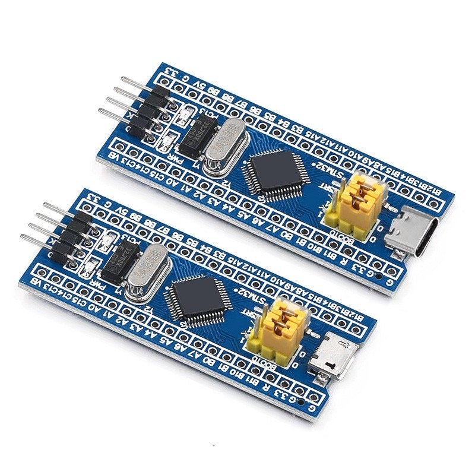

# STM32F103C6 Blinky Demo Project

🎯 This demo project introduces the basic structure of an embedded C program using the STM32F103C6 microcontroller. The main objective is to demonstrate how to configure and control the on-board LED (connected to pin PC13) by toggling it at regular intervals.

<!-- Images Placeholder -->

<!-- Add more images as needed -->

📑 The project covers essential elements of embedded C programming, including hardware initialization, main application loop, and simple delay mechanisms. It serves as a starting point for beginners to understand how to interact with microcontroller peripherals and build more complex applications.

🔑 Key features:
- STM32F103C6 microcontroller
- On-board LED blinking (PC13)
- Simple and clear embedded C code structure

🔧 I use STM32CubeMX for hardware configuration and initialization, and Keil uVision IDE for writing, building, and debugging the embedded C code.

<!-- Images Placeholder -->

<!-- Add more images as needed -->

🚀 [This example](/stm32f103c6-demo/source-code/) is ideal for learning the fundamentals of embedded software development and getting hands-on experience with STM32 microcontrollers.
- 🔨 Development Boards: [STM32F103 Blue Pill Development Board](/README.md)
- 🔧 Tools: [Keil uVision](/README.md)

# Explore More Topics
|[👈 Previous](/stm32f103c6-demo/README.md) | [Next 👉](/struct-union-data-types/README.md)|

# Demo Projects
🚀 [Demo Projects](/)

# Repositories
🏠 [My Repositories](https://github.com/embesyslabs)

# My Website
🌐 [Embedded Software Labs](https://embesyslabs.github.io/)

# Contact & Discussion
If you have any thing would like to discuss or cooperate with me, please don't hesitate to contact me via:
- 📧 Email [Ho Thien Ai](mailto:thienaiho95@gmail.com)
- 💼 LinkedIn [Thien Ai Ho](https://www.linkedin.com/in/thien-ai-ho/)