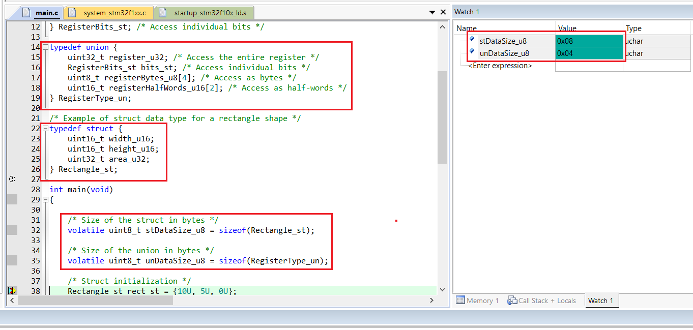
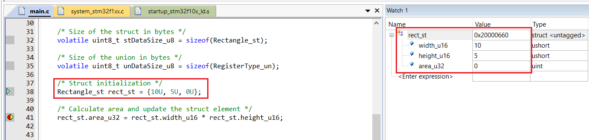
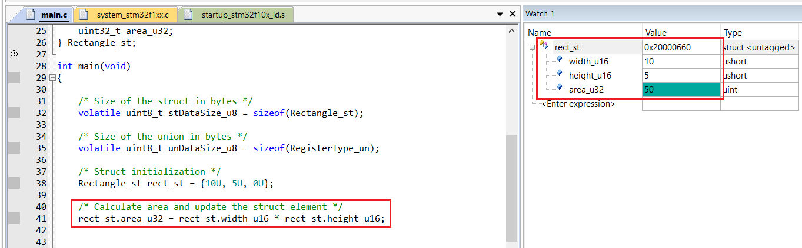
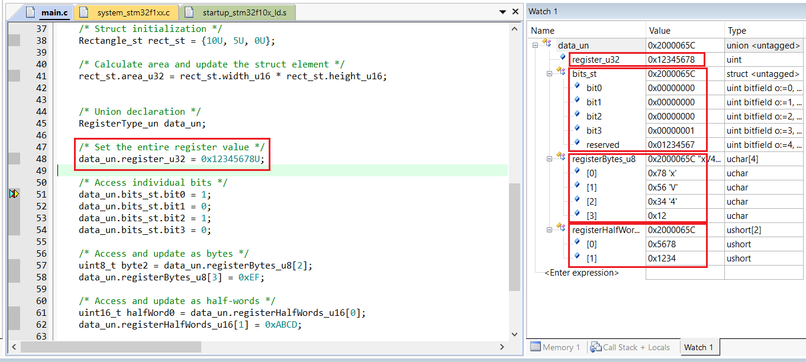
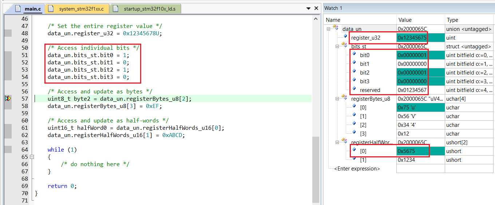
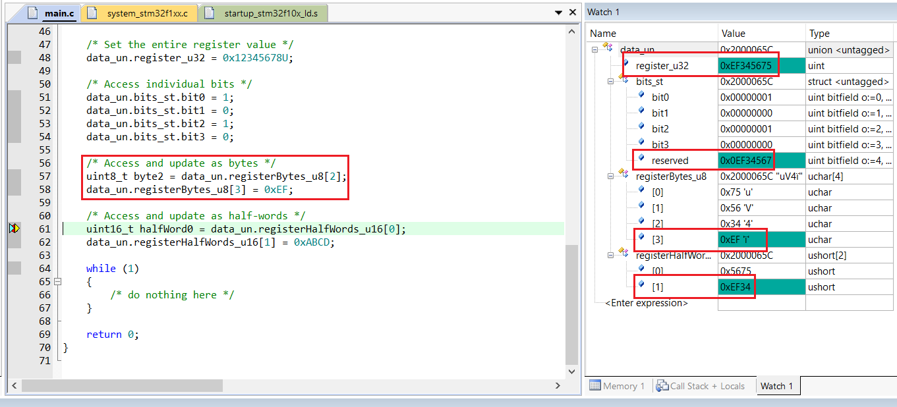
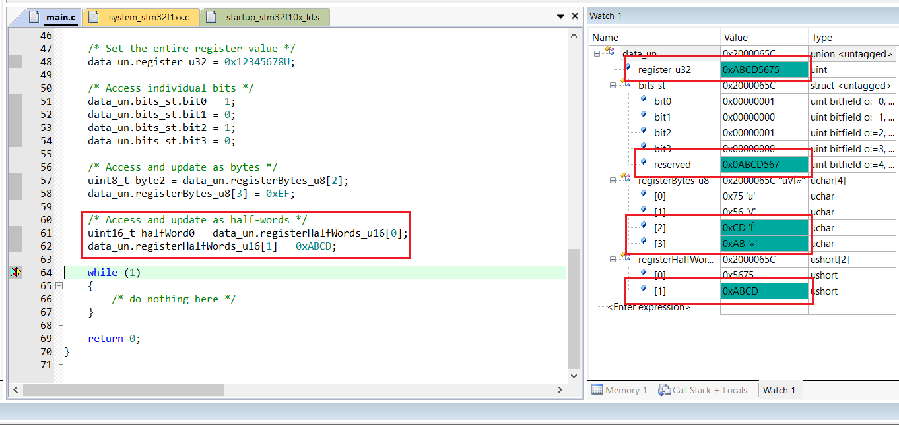
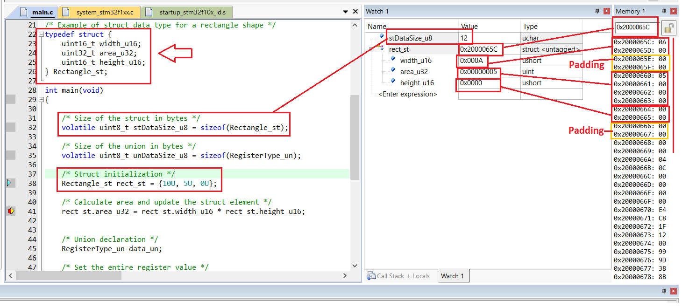
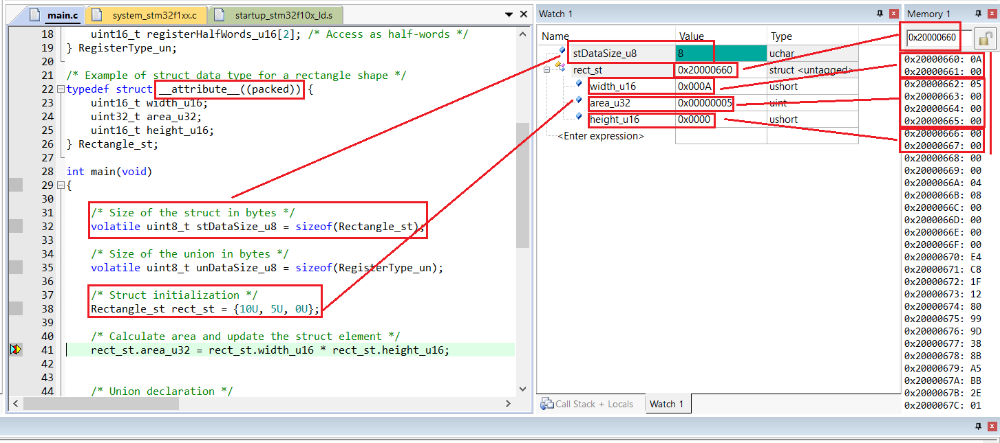

# Struct and Union Data Types

🎯 In embedded C programming, struct and union are essential user-defined data types that enable efficient management of related data. A struct (structure) allows grouping variables of different types under a single name, making it easier to organize and access complex data, such as sensor readings or device configurations. Each member of a struct occupies its own memory space, enabling simultaneous storage of multiple values.

<!-- Images Placeholder -->

<!-- Add more images as needed -->

💡 A union, on the other hand, provides a way to store different data types in the same memory location. All members of a union share the same memory, so only one value can be stored at a time. This is particularly useful in memory-constrained embedded systems where optimizing resource usage is critical.

💡 Both struct and union play a vital role in embedded applications, offering flexibility, improved code readability, and efficient memory management for handling diverse data requirements.

## Struct Data Type
### Key Points
🔑 Here are the key points of the struct data type in C:
- A struct groups variables of different types under a single name.
- Each member of a struct has its own memory location.
- Structs help organize related data, improving code readability and maintainability.
- Members are accessed using the dot (.) operator.
- Structs can be nested and used in arrays or pointers.
- Widely used for representing complex data structures in embedded systems.

### Use Cases
Here’s a typical use case for using the struct data type in embedded systems:

📌 Structs are commonly used to group related data for hardware peripherals, such as sensors or communication modules. For example, you can define a struct to store all relevant information about a sensor, including its ID, measurement value, status, and configuration settings. This approach simplifies data management, improves code readability, and makes it easier to pass complex data between functions or modules in embedded applications.
### Declaration
- In C, a struct data type is declared using the `struct` keyword followed by the structure name and its member definitions. For example:
```C
struct Sensor {
    int id;
    float value;
    char status;
};
```
- This declares a struct named Sensor with three members: id, value, and status.

### Initialization
- You can initialize a struct data type in C at the time of declaration or later in your code. Here’s an example:
```C
struct Sensor sensor1 = {1, 23.5, 'A'};
```
- This creates a Sensor struct variable named sensor1 and initializes its members with values.
- 
### Modification
- You can modify the members of a struct in C using the dot (`.`) operator. For example:
```C
sensor1.value = 25.0;
sensor1.status = 'B';
```
- This updates the value and status members of the sensor1 struct variable.

## Union Data Type
### Key Points
🔑 Here are the key points of the `union` data type in C:
- A union allows storing different data types in the same memory location.
- All members of a union share the same memory space; only one member can hold a value at a time.
- The size of a union is determined by its largest member.
- Useful for memory optimization in embedded systems.
- Members are accessed using the dot (`.`) operator.
- Widely used for handling data that may take different forms.
### Use Cases
Here’s a typical use case for using the union data type in embedded systems:

📌 Unions are commonly used when a variable may need to store different types of data at different times, such as protocol packets, hardware registers, or interpreting raw data from peripherals. For example, a union can be used to access the same memory as an integer or a byte array, depending on the application’s requirements. This approach helps save memory and simplifies data handling in embedded applications.

### Declaration
- In C language, a union data type is declared using the `union` keyword followed by the union name and its member definitions. For example:
```C
union Data {
    int intValue;
    char byteArray[4];
};
```
- This declares a union named Data with three members: intValue, and byteArray.

### Initialization
- You can initialize a union data type in C at the time of declaration or later in your code. Here’s an example:
```C
union Data data1;
data1.intValue = 100;
```
- This creates a Data union variable named data1 and initializes its intValue member.

### Modification
- You can modify the members of a union in C using the dot (`.`) operator. For example:
```C
data1.byteArray[0] = 10;
```
> [!CAUTION]
This updates the `byteArray[0]` member of the data1 union variable. Note that modifying one member will overwrite the value of other members, since all share the same memory.

## Demo Project

🚀 Source code: [demo project](/struct-union-data-types/source-code/)

- You can use this [demo project](/struct-union-data-types/source-code/) to gain hands-on experience with struct and union data types in embedded software. In this project, I demonstrate:

### How to calculate the size of struct and union data types?
👉 The size of a struct is typically the sum of the sizes of all its members, plus any padding added for alignment. For a union, its size is determined by its largest member, since all members share the same memory space.

```C
// Example: struct data type for a rectangle shape
typedef struct {
	uint16_t width_u16;
	uint16_t height_u16;
	uint32_t area_u32;
} Rectangle_st;
```

```C
// Example: union data type for register access
typedef struct {
	uint32_t bit0 : 1;
	uint32_t bit1 : 1;
	uint32_t bit2 : 1;
	uint32_t bit3 : 1;
	uint32_t reserved : 28;
} RegisterBits_st; // Access individual bits

typedef union {
	uint32_t register_u32;        // Access the entire register
	RegisterBits_st bits_st;      // Access individual bits
	uint8_t registerBytes_u8[4];  // Access as bytes
	uint16_t registerHalfWords_u16[2]; // Access as half-words
} RegisterType_un;
```
> [!TIP]
Using typedef before struct and union lets you create a type alias for the structure or union. This makes your code cleaner and easier to read, as you can use the alias directly without repeatedly writing struct or union before variable declarations. For example, with `typedef struct { ... } RegisterBits_st;`, you can declare variables as `RegisterBits_st reg;` instead of `struct RegisterBits_st reg;`. This is especially useful in embedded systems where code clarity and brevity are important.

👉 Actual size of struct and union data types in embedded system memory:
<!-- Images Placeholder -->

<!-- Add more images as needed -->

- Size of Rectangle_st = `2` (width_u16) + `2` (height_u16) + `4` (area_u32) = `8` bytes
- Size of RegisterType_un = maximum of (`4` (register_u32), `4` (bits_st), `4` (registerBytes_u8[4]), `4` (registerHalfWords_u16[2])) = `4` bytes

### Initialize the struct variable
👉 You can initialize a struct variable when you declare it, assigning values to its members immediately.
<!-- Images Placeholder -->

<!-- Add more images as needed -->

### Modify struct members
👉 After a struct variable has been declared, you can update its members at any time using the dot operator.
<!-- Images Placeholder -->

<!-- Add more images as needed -->

### Modify union members
👉 You can modify any member of a union variable after it has been declared. However, updating one member will immediately affect the values of all other members, since they share the same memory space.

- Set the entire register value:
<!-- Images Placeholder -->

<!-- Add more images as needed -->

- Set individual bit values:
<!-- Images Placeholder -->

<!-- Add more images as needed -->

- Update union member value as bytes:
<!-- Images Placeholder -->

<!-- Add more images as needed -->

- Update union member value as half-words:
<!-- Images Placeholder -->

<!-- Add more images as needed -->

### Padding bytes for aligment
> [!IMPORTANT]
The order of struct members can impact the overall size of a struct because of memory alignment and padding. Grouping members of similar or decreasing size together helps minimize padding and improves memory efficiency.

> [!IMPORTANT]
The amount of padding bytes inserted depends on the microcontroller's architecture and its memory alignment requirements.

👇 The following demonstration shows how padding bytes are used for alignment in the 32-bit STM32F103C6 microcontroller and offers tips for optimizing memory usage.

#### Padding bytes in microcontroller memory layout
👉 Padding bytes may be inserted if struct members are not arranged efficiently. For example, 2 bytes of padding can be added after a `uint16_t` member to align the next member on a 32-bit boundary. The `uint32_t` member naturally fits the 32-bit memory layout without requiring extra padding.

```C
typedef struct {
	uint16_t width_u16;
	uint32_t area_u32;
	uint16_t height_u16;
} Rectangle_st;
```
The padding bytes are visible in the microcontroller's memory layout:
<!-- Images Placeholder -->

<!-- Add more images as needed -->

#### How to remove padding bytes to save memory?
> [!TIP]
One effective way to reduce padding bytes is to arrange struct members from largest to smallest, or to group them according to the bit-width supported by the microcontroller.

```C
typedef struct {
	uint16_t width_u16;
	uint32_t area_u32;
	uint16_t height_u16;
} Rectangle_st;
```
> [!TIP]
Another method is to use compiler-specific features, such as the `packed` attribute in the ARM compiler, to force members to be allocated consecutively without padding. Similar options are available in other compilers.

```C
typedef struct __attribute__((packed)) {
	uint16_t width_u16;
	uint32_t area_u32;
	uint16_t height_u16;
} Rectangle_st;
```
- With this approach, struct members are placed directly next to each other, eliminating padding bytes:
<!-- Images Placeholder -->

<!-- Add more images as needed -->

🚀 You can use this [demo project](/struct-union-data-types/source-code/) to experiment further and deepen your understanding of struct and union data types.
- 🔨 Development Boards: [STM32F103 Blue Pill Development Board](/README.md)
- 🔧 Tools: [Keil uVision](/README.md)

# Explore More Topics
|[👈 Previous](/embedded-c-data-types/README.md) | [Next 👉](/)|

# Demo Projects
🚀 [Demo Projects](/)

# Repositories
🏠 [My Repositories](https://github.com/jet-studio)

# My Website
🌐 [Jet Studio](https://jet-studio.github.io/)

# Contact & Discussion
If you have any thing would like to discuss or cooperate with me, please don't hesitate to contact me via:
- 📧 Email [Ho Thien Ai](mailto:thienaiho95@gmail.com)
- 💼 LinkedIn [Thien Ai Ho](https://www.linkedin.com/in/thien-ai-ho/)